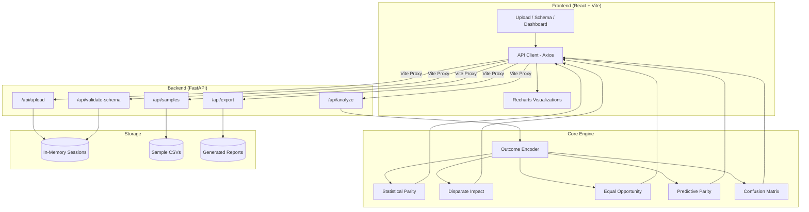
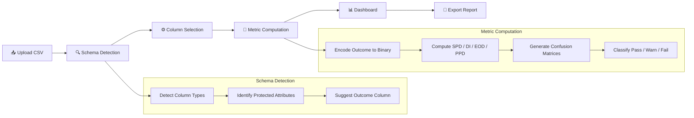

# 🔍 BiasLens — Fairness Auditor

**Plug-and-play fairness auditing tool for AI decision systems.**  
Upload a dataset, select columns, and instantly get bias metrics, visualizations, and exportable compliance reports — no ML expertise required.


---

## Table of Contents

- [Overview](#overview)
- [Architecture](#architecture)
- [Analysis Pipeline](#analysis-pipeline)
- [Fairness Metrics](#fairness-metrics)
- [Tech Stack](#tech-stack)
- [Getting Started](#getting-started)
- [API Reference](#api-reference)
- [Project Structure](#project-structure)

---

## Overview

BiasLens enables non-technical users to audit AI systems for demographic bias. It computes four industry-standard fairness metrics across protected groups and generates compliance-ready reports.

**Key Features:**
- 📤 CSV upload with auto-delimiter detection
- 🧠 Smart schema detection (auto-identifies protected attributes and outcome columns)
- 📊 Four fairness metrics with traffic-light pass/warning/fail indicators
- 📈 Interactive charts and confusion matrix heatmaps
- 📄 One-click PDF report export
- 🧪 Built-in sample datasets (UCI Adult Income, COMPAS Recidivism)

---

## Architecture



---

## Analysis Pipeline



---

## Fairness Metrics

| Metric | Formula | Fair Range | Measures |
|--------|---------|------------|----------|
| **Statistical Parity Difference** | P(Y=1\|privileged) − P(Y=1\|unprivileged) | −0.1 to 0.1 | Equal approval rates across groups |
| **Disparate Impact** | P(Y=1\|unprivileged) / P(Y=1\|privileged) | 0.8 to 1.25 | Four-fifths rule compliance |
| **Equal Opportunity Difference** | TPR(privileged) − TPR(unprivileged) | −0.1 to 0.1 | Equal true positive rates |
| **Predictive Parity Difference** | PPV(privileged) − PPV(unprivileged) | −0.1 to 0.1 | Equal prediction accuracy |

Each metric is classified:
- 🟢 **Pass** — within fair range
- 🟡 **Warning** — marginal
- 🔴 **Fail** — bias detected

---

## Tech Stack

| Layer | Technology |
|-------|-----------|
| **Frontend** | React 18, TypeScript, Vite, Tailwind CSS, Recharts |
| **Backend** | Python 3.10+, FastAPI, Pydantic v2, Uvicorn |
| **Analysis** | Pandas, NumPy, Scikit-learn |
| **Reports** | ReportLab (PDF), Jinja2 (HTML) |
| **DevOps** | Docker, Docker Compose |

---

## Getting Started

### Prerequisites

- Python 3.10+
- Node.js 18+
- npm

### Backend Setup

```bash
cd backend
pip install -r requirements.txt
python -m uvicorn main:app --host 0.0.0.0 --port 8000 --reload
```

### Frontend Setup

```bash
cd frontend
npm install
npm run dev
```

The app will be available at **http://localhost:3000**

### Docker (Alternative)

```bash
docker-compose up --build
```

---

## API Reference

| Method | Endpoint | Description |
|--------|----------|-------------|
| `POST` | `/api/upload` | Upload CSV file (multipart/form-data) |
| `POST` | `/api/validate-schema` | Detect column types & suggest attributes |
| `POST` | `/api/analyze` | Run fairness analysis |
| `POST` | `/api/export` | Generate PDF/HTML report |
| `GET`  | `/api/download/{id}` | Download generated report |
| `GET`  | `/api/samples/` | List sample datasets |
| `POST` | `/api/samples/{name}/load` | Load a sample dataset |
| `GET`  | `/health` | Health check |

### Example: Run Analysis

```bash
curl -X POST http://localhost:8000/api/analyze \
  -H "Content-Type: application/json" \
  -d '{
    "session_id": "<session-id-from-upload>",
    "protected_attribute": "sex",
    "outcome_column": "income"
  }'
```

---

## Project Structure

```
bias-lens/
├── backend/
│   ├── main.py                  # FastAPI app entry point
│   ├── models.py                # Pydantic request/response models
│   ├── fairness_utils.py        # Core fairness metric computations
│   ├── utils.py                 # Session & file utilities
│   ├── error_handlers.py        # Custom exception handlers
│   ├── report_generator.py      # PDF report generation
│   ├── html_report_generator.py # HTML report generation
│   ├── requirements.txt         # Python dependencies
│   ├── Dockerfile
│   ├── fixtures/                # Sample datasets
│   │   ├── adult_income.csv
│   │   └── compas.csv
│   └── routers/
│       ├── upload.py            # File upload & session management
│       ├── schema.py            # Schema detection & validation
│       ├── analyze.py           # Fairness analysis endpoint
│       ├── export.py            # Report export & download
│       └── samples.py           # Sample dataset management
├── frontend/
│   ├── src/
│   │   ├── App.tsx              # Main app with state management
│   │   ├── api.ts               # API client (Axios)
│   │   ├── types.ts             # TypeScript interfaces
│   │   └── components/
│   │       ├── UploadComponent.tsx
│   │       ├── SchemaValidator.tsx
│   │       ├── Dashboard.tsx
│   │       ├── MetricCard.tsx
│   │       ├── ApprovalRateChart.tsx
│   │       ├── ConfusionMatrixHeatmap.tsx
│   │       ├── ReportExporter.tsx
│   │       ├── SampleDatasets.tsx
│   │       ├── PreviewTable.tsx
│   │       └── ErrorBoundary.tsx
│   ├── package.json
│   ├── vite.config.ts
│   ├── tailwind.config.js
│   └── Dockerfile
├── docker-compose.yml
└── README.md
```

---

<p align="center">Built for fair AI 🤝</p>
